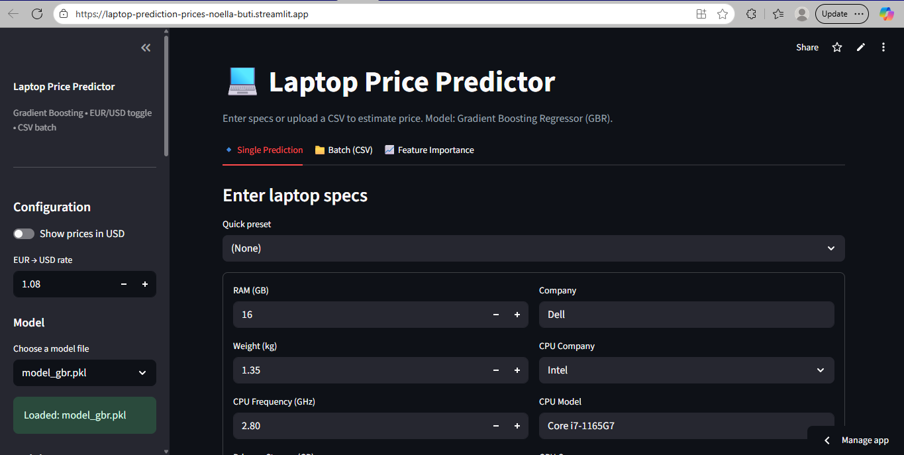

# Laptop Price Prediction 💻💶  
Predict Laptop Prices (€) from Specifications using Machine Learning  


👉 [**Live Demo (Streamlit)**](https://laptop-prediction-prices.streamlit.app/)  



---

## ✨ Overview
This project predicts laptop prices in Euros (€) based on their specifications using regression and ensemble methods.  
It includes **exploratory data analysis (EDA)**, model training, and an interactive **Streamlit app** for single or batch predictions.  

---

## 🔍 Features
- Exploratory Data Analysis with visualizations  
- Regression models: Linear Regression, Random Forest, Gradient Boosting  
- Evaluation: MAE, MSE, R²  
- Saves trained models & metrics as artifacts  
- Interactive **Streamlit app** for inference  

---

## 🚦 Quickstart

### Train model
```bash
python src/train.py
```

Run Streamlit app
```bash
streamlit run src/app.py
```

Run tests
```bash
pytest -q
```

## 📁 Repository Layout
```bash
ai-laptop-price-prediction/
├─ data/           # raw & preprocessed datasets
├─ notebooks/      # EDA and modeling notebooks
├─ src/            # training script & Streamlit app
├─ reports/        # metrics, plots, training results
├─ artifacts/      # saved models
├─ requirements.txt
└─ README.md
```

## 📊 Results (Held-Out Test Set)
| Model               |    MSE   |  RMSE  |   R²   |
|---------------------|---------:|-------:|-------:|
| Linear Regression   | 172,467  | 415.29 | 0.653  |
| Random Forest       | 87,042   | 295.03 | 0.825  |
| Gradient Boosting   | 58,510   | 241.89 | 0.882  |
| **Final GB (CV best)** |   —     | 237.80 | **0.886** |

## 🔮 Roadmap
- Add hyperparameter search with Optuna
- Dockerize for consistent deployment
- CI/CD pipeline for auto-deploy

## 📜 License
MIT (see LICENSE)

---
